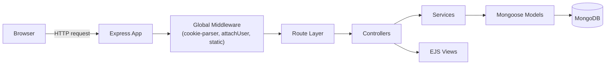
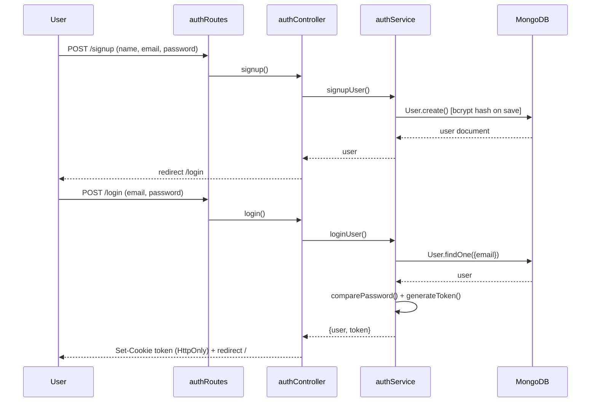
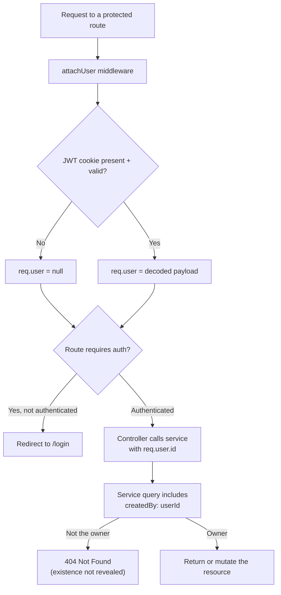
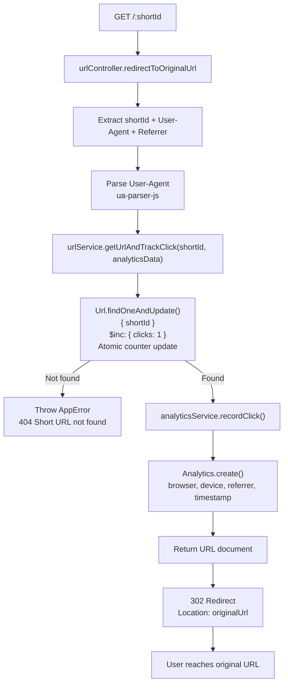
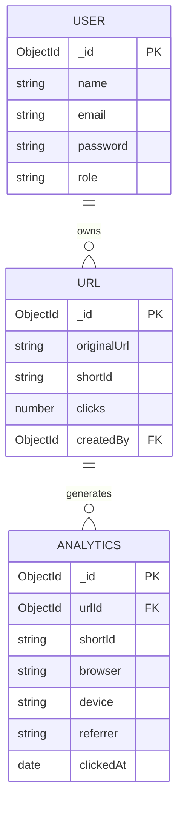

# SmartLink

**A production-grade URL shortening and management platform** — Node.js, Express,
MongoDB, and EJS, built on a layered MVC architecture with real authentication,
ownership-based authorization, and click analytics backed by MongoDB aggregation
pipelines.

Unlike a typical shortener tutorial project, every URL belongs to an authenticated
user, every mutation is ownership-checked at the query level, and every redirect is
tracked atomically for per-link analytics (daily/weekly/monthly trends, browser,
device, and referrer breakdowns).

---

## Table of contents

- [Features](#features)
- [Tech stack](#tech-stack)
- [Architecture](#architecture)
- [Authentication & authorization](#authentication--authorization)
- [Short ID generation & collision handling](#short-id-generation--collision-handling)
- [Click tracking & analytics](#click-tracking--analytics)
- [Database schema](#database-schema)
- [Performance](#performance)
- [Project structure](#project-structure)
- [Routes](#routes)
- [Security notes](#security-notes)
- [Scope & future work](#scope--future-work)

---

## Features

- **Shorten and manage links** — create short URLs, edit the destination, or delete
  a link, all scoped to the authenticated user's own dashboard.
- **JWT authentication with HTTP-only cookies** — signup/login issue a signed JWT
  stored as an `HttpOnly`, `SameSite=Strict` cookie, never exposed to client-side JS.
- **Ownership-based authorization** — every read/update/delete query is filtered by
  `createdBy: userId` at the database level, not just checked in application code, so
  a user can never access or modify another user's links even if they know the
  short ID.
- **Collision-resistant short ID generation** — `nanoid`-based IDs with a bounded
  retry loop against MongoDB's unique index on `shortId`, rather than trusting
  collision probability blindly.
- **Atomic click tracking** — every redirect increments the click counter via a
  single atomic `findOneAndUpdate` + `$inc`, avoiding the classic read-modify-write
  race condition of concurrent redirects under load.
- **Traffic analytics via MongoDB aggregation pipelines** — per-link daily, weekly,
  and monthly click trends, plus browser/device/referrer breakdowns, computed
  entirely in the database rather than pulled into application memory.
- **Server-rendered dashboard** — EJS views for home, signup/login, dashboard,
  edit-link, and per-link analytics.

## Tech stack

| Layer | Technology |
|---|---|
| Backend | Node.js, Express.js (ES modules) |
| Database | MongoDB, Mongoose ODM |
| Views | EJS (server-rendered) |
| Auth | JSON Web Tokens (`jsonwebtoken`) + `HttpOnly` cookies, `bcrypt` password hashing |
| Short ID generation | `nanoid` |
| Analytics | `ua-parser-js` (browser/device detection) + MongoDB Aggregation Pipelines |
| Testing | Jest, Supertest, `mongodb-memory-server` |
| Dev tooling | `nodemon` |

## Architecture

A strict layered MVC: **routes → controllers → services → models**. Controllers only
ever translate HTTP ↔ service calls — no Mongoose queries and no business rules live
in a controller. Business logic (uniqueness retries, ownership filtering, password
comparison, aggregation queries) lives entirely in `services/`, which makes it
testable without an HTTP layer at all.



`app.js` mounts `authRoutes` and `analyticsRoutes` **before** `urlRoutes`, because
`urlRoutes` contains the catch-all `GET /:shortId` redirect — if that were mounted
first, it would shadow every other route (e.g. `/dashboard` would be interpreted as
a short ID lookup instead).

## Authentication & authorization

Signup hashes the password via a Mongoose `pre('save')` hook (`bcrypt`, 10 salt
rounds) — plaintext passwords never touch the database. Login verifies the password
and issues a JWT (7-day expiry) containing `{ id, role }`, set as an `HttpOnly`,
`SameSite=Strict` cookie so it's inaccessible to client-side JavaScript and not sent
on cross-site requests.



`attachUser` runs globally on every request and decodes the cookie into `req.user`
when present. **Authorization is then enforced per-query, not just per-route:**
`getUserUrls`, `getUrlByIdAndOwner`, `updateUrl`, and `deleteUrl` all filter by
`createdBy: userId` inside the MongoDB query itself, so ownership can't be bypassed
by forging a request that skips a middleware check.



A deliberate choice worth calling out: a non-owner accessing someone else's link
gets a **404**, not a 403. Returning 403 would confirm the link exists but isn't
theirs; 404 gives an attacker no information about whether the resource exists at
all.

## Short ID generation & collision handling

Short IDs are generated with `nanoid` and written under MongoDB's `unique` index on
`shortId`. Rather than assuming collisions can't happen, `createShortUrl` retries
generation up to `MAX_COLLISION_RETRIES` (5) times, catching MongoDB's duplicate-key
error (code `11000`) specifically — any other error is rethrown immediately rather
than silently retried:

```js
while (attempt < MAX_COLLISION_RETRIES) {
  const shortId = generateShortId();
  try {
    return await Url.create({ originalUrl, shortId, createdBy: userId });
  } catch (err) {
    if (err.code === 11000) { attempt += 1; continue; } // genuine collision — retry
    throw err;                                            // anything else — surface it
  }
}
throw new AppError("Could not generate a unique short URL, please try again", 500);
```

## Click tracking & analytics
Every redirect atomically increments the click counter using Url.findOneAndUpdate({ shortId }, { $inc: { clicks: 1 } }), preventing lost updates under concurrent traffic. Detailed click analytics are then recorded separately via recordClick()



`getAnalyticsSummary(shortId)` then computes, entirely via MongoDB Aggregation
Pipelines (no in-memory processing):

- **Total clicks** (`countDocuments`)
- **Daily / weekly / monthly click trends** (`$group` by `$dateToString` on
  `clickedAt`, sorted chronologically)
- **Browser, device, and referrer breakdowns** (`$group` + count, sorted descending)

## Database schema



Indexes: `Url.shortId` (unique — enforces both fast redirect lookups and collision
detection), `Url.createdBy` (fast per-user dashboard queries),
`Analytics.urlId`/`Analytics.shortId`/`Analytics.clickedAt` (fast per-link,
time-ranged aggregation).

## Performance

In local testing, redirect lookups (`GET /:shortId`) averaged **~7ms response time
across 100 sequential requests**, backed by the unique index on `shortId` for O(log
n) lookups and the atomic `$inc` avoiding any extra round trip for click tracking.
*(Local benchmark on development hardware — not a production load-test guarantee;
real-world latency depends on network, MongoDB deployment, and concurrent load.)*

## Project structure
```
smartlink/
├── app.js
├── package.json
├── README.md
├── config/
│ ├── index.js
│ └── db.js
├── controllers/
│ ├── analyticsController.js
│ ├── authController.js
│ └── urlController.js
├── docs/
│ ├── 01-project-overview.md
│ ├── 02-folder-structure.md
│ ├── 03-database-design.md
│ ├── 05-url-shortening-deep-dive.md
│ └── 09-api-documentation.md
├── middlewares/
│ ├── authMiddleware.js
│ ├── errorHandler.js
│ └── notFound.js
├── models/
│ ├── Analytics.js
│ ├── Url.js
│ └── User.js
├── public/
│ ├── css/style.css
│ ├── js/main.js
│ └── images/
├── routes/
│ ├── analyticsRoutes.js
│ ├── authRoutes.js
│ └── urlRoutes.js
├── services/
│ ├── analyticsService.js
│ ├── authService.js
│ └── urlService.js
├── tests/
│ └── url.service.test.js
├── utils/
│ ├── AppError.js
│ ├── generateShortId.js
│ └── isValidUrl.js
└── views/
├── partials/{header,footer}.ejs
├── analytics.ejs
├── dashboard.ejs
├── edit-url.ejs
├── error.ejs
├── home.ejs
├── login.ejs
└── signup.ejs
```
## Routes

| Method | Path | Handler | Auth required |
|---|---|---|---|
| GET | `/signup` | `authController.renderSignup` | No* |
| POST | `/signup` | `authController.signup` | No |
| GET | `/login` | `authController.renderLogin` | No* |
| POST | `/login` | `authController.login` | No |
| GET | `/logout` | `authController.logout` | No |
| GET | `/` | `urlController.renderHome` | Yes |
| POST | `/api/shorten` | `urlController.createShortUrl` | Yes |
| GET | `/dashboard` | `urlController.renderDashboard` | Yes |
| GET | `/urls/:shortId/edit` | `urlController.renderEditUrl` | Yes |
| POST | `/urls/:shortId/edit` | `urlController.editUrl` | Yes |
| POST | `/urls/:shortId/delete` | `urlController.deleteUrl` | Yes |
| GET | `/analytics/:shortId` | `analyticsController.renderAnalytics` | Yes |
| GET | `/:shortId` | `urlController.redirectToOriginalUrl` | No — must stay last |

\* `/signup` and `/login` use `redirectIfAuthenticated`, so authenticated users are redirected away from these pages.

## Security notes

- Passwords are hashed with `bcrypt` (10 rounds) before storage — never logged or
  stored in plaintext.
- JWTs are stored in `HttpOnly`, `SameSite=Strict` cookies — inaccessible to XSS via
  `document.cookie`, and not attached to cross-site requests.
- Ownership is enforced **inside the database query** (`createdBy: userId`), not
  only in a middleware check — an authorization bug in one layer can't silently
  expose another user's data.
- Non-owners get `404`, not `403`, on someone else's resource — existence isn't
  leaked to unauthorized users.

## Scope & future work

Deliberately deferred rather than overlooked (see the design note in `models/Url.js`
— fields are added when there's a concrete use case, not speculatively):

- Custom aliases for short links
- Link expiration / scheduled deactivation
- Rate limiting on link creation and redirects
- Enforcing the `role: ADMIN` field (currently present on `User` but not yet used
  anywhere in the authorization logic)
- QR code generation per short link