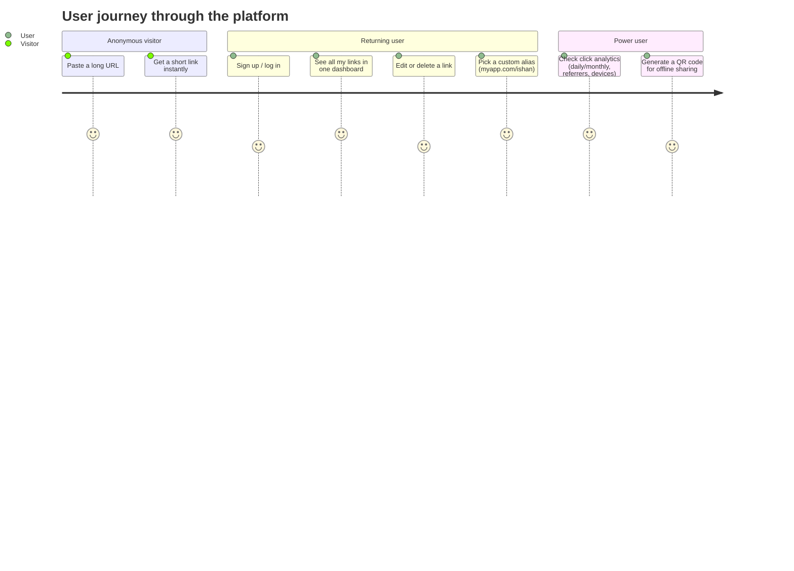

# 01 — Project Overview

## What this project is

A **URL Management Platform** — not just a "paste a link, get a short link"
toy, but the backend you'd actually need if you were the founding engineer
asked to build Bitly's MVP and grow it into something with accounts,
analytics, and custom branding.

The distinction matters for how you talk about this project in an
interview. "I built a URL shortener" sounds like a weekend tutorial.
"I built a multi-tenant link management platform with click analytics,
collision-safe ID generation, and JWT-based auth" sounds like what it
actually is once all 7 phases are done.

## Why URL shorteners are a genuinely good portfolio project

They look small but force you to engineer around real constraints:

| Constraint | Why it's hard | What it teaches |
|---|---|---|
| A redirect is a **read-heavy, latency-sensitive hot path** | Every short link gets hit far more often than it's created | Indexing, caching strategy, read/write ratio thinking |
| Short IDs must be **unique under concurrent writes** | Two users could generate the same ID at the same instant | Atomic operations, unique indexes, collision handling |
| Click counts must be **accurate under concurrency** | Many simultaneous redirects increment the same counter | Atomic `$inc`, race conditions, why `read → modify → write` is dangerous |
| The system **grows new dimensions over time** (auth, analytics, aliases) | Real products are never "done" on day one | Schema evolution, backward compatibility, incremental architecture |

This is also why the project is staged the way it is: Phase 1 forces you to
get the data model and the hot path right *before* anything else gets
layered on top.

## Real-world examples this project is modeled on

- **Bitly** — the canonical link shortener; pioneered click analytics as
  the real product (the redirect is free, the data is the business).
- **TinyURL** — older, simpler; mostly just ID generation + redirect, a
  good reference for "what's the absolute minimum."
- **Short links inside larger products** — Twitter's `t.co`, payment
  links (Stripe, Razorpay), App Store smart links. These all reuse the
  same core mechanic: opaque short ID → stored destination → redirect →
  log the event.

## User journey (end state, after all 7 phases)

Phase 1 (this stage) covers only the first section: **paste → get a short
link → redirect works → clicks are counted**. Everything else is staged
on top of that foundation in later phases.

## Feature overview by phase

| Phase | Feature | Status |
|---|---|---|
| 1 | Core shortener (create, redirect, click count) | ✅ Done |
| 2 | Authentication (signup, login, JWT, cookies) | ⏳ Next |
| 3 | User dashboard (per-user URLs, edit, delete) | Planned |
| 4 | Analytics (daily/monthly clicks, referrer, device) | Planned |
| 5 | Custom aliases | Planned |
| 6 | QR code generation | Planned |
| 7 | Security hardening (Helmet, rate limiting, validation) | Planned |

## Key product decisions made in Phase 1 (and why)

1. **Anonymous shortening is allowed.** Real products (Bitly included)
   let you shorten a link without an account — friction kills adoption.
   Auth (Phase 2) adds *ownership* of links, it doesn't gate the core
   feature.
2. **Server-rendered EJS, not a separate frontend framework.** Keeps the
   project backend-focused and realistic for the stated scope (no
   Docker/microservices/cloud infra) while still shipping a real, usable
   UI you can demo.
3. **MongoDB over a relational database.** A `Url` document is
   self-contained (no joins needed for the core read path), and the
   schema is expected to evolve as phases are added — documents are
   forgiving of that in a way that requires fewer migrations than a rigid
   relational schema would. (This tradeoff is discussed honestly, not
   just asserted — see docs/03-database-design.md.)
4. **A service layer between controllers and the database**, even though
   Phase 1's logic is simple enough to live in the controller. This is a
   deliberate architectural investment: by Phase 4 (analytics
   aggregation) and Phase 7 (validation), the service layer is what keeps
   controllers thin. Introducing it on day one avoids a painful refactor
   later — and "why did you introduce a layer before you needed it" /
   "when *wouldn't* you" is itself a good interview question to be ready
   for.

## What "production-quality" means for a project this size

It does **not** mean Kubernetes and microservices — the brief explicitly
rules those out, correctly, because they'd be cargo-culting infrastructure
a single-service app at this scale doesn't need. It means:

- Errors are handled centrally and consistently, not with scattered
  try/catch and inconsistent status codes.
- The data layer uses atomic operations where concurrency matters,
  instead of "it'll probably be fine."
- Configuration is centralized and fails loudly if misconfigured, instead
  of silently falling back to `undefined`.
- Code is organized so that business logic is testable without spinning
  up an HTTP server.
- Every architectural choice has a documented reason — so in an
  interview, "why did you do X" never gets a shrug.
