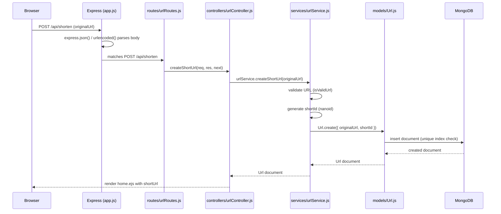
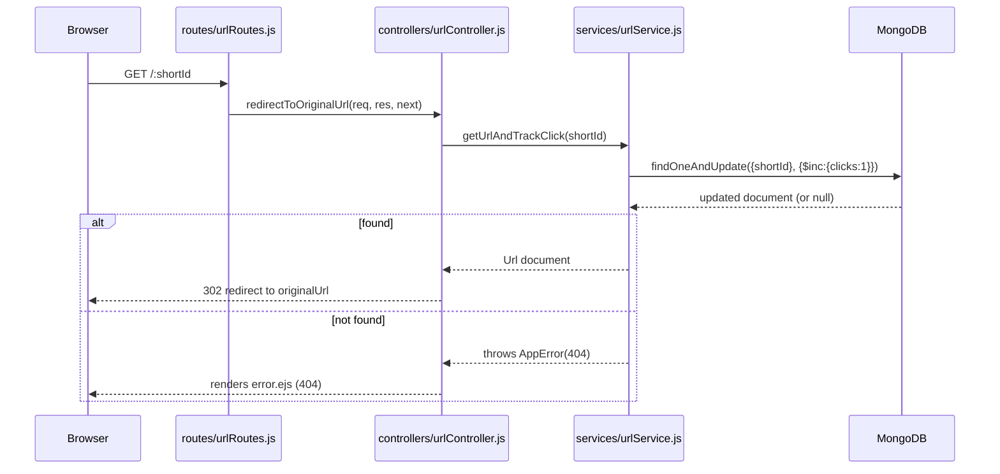

# 02 — Folder Structure & MVC Architecture

## Current structure

```
smartlink/
├── app.js
├── package.json
├── README.md
├── config/
│   ├── index.js
│   └── db.js
├── controllers/
│   ├── analyticsController.js
│   ├── authController.js
│   └── urlController.js
├── docs/
│   ├── 01-project-overview.md
│   ├── 02-folder-structure.md    # you are here
│   └── 09-api-documentation.md
├── middlewares/
│   ├── authMiddleware.js
│   ├── errorHandler.js
│   └── notFound.js
├── models/
│   ├── Analytics.js
│   ├── Url.js
│   └── User.js
├── public/
│   ├── css/
│   │   └── style.css
│   ├── js/
│   │   └── main.js
│   └── images/
├── routes/
│   ├── analyticsRoutes.js
│   ├── authRoutes.js
│   └── urlRoutes.js
├── services/
│   ├── analyticsService.js
│   ├── authService.js
│   └── urlService.js
├── tests/
│   └── url.service.test.js
├── utils/
│   ├── AppError.js
│   ├── generateShortId.js
│   └── isValidUrl.js
└── views/
    ├── partials/
    │   ├── header.ejs
    │   └── footer.ejs
    ├── analytics.ejs
    ├── dashboard.ejs
    ├── edit-url.ejs
    ├── error.ejs
    ├── home.ejs
    ├── login.ejs
    └── signup.ejs
```

`controllers/`, `middlewares/`, `models/`, `routes/`, `services/`, `utils/`
are all flat now because Phase 1 has one resource (`Url`). From Phase 2
onward they gain subfolders/files per resource (e.g.
`controllers/authController.js`, `models/User.js`) rather than being
restructured into nested folders — flat-but-named-by-resource scales fine
up to a handful of resources, which is all this project needs.

## Why MVC, and what each layer is actually responsible for

MVC (Model-View-Controller) is often taught as "M = database, V =
frontend, C = everything else," which is exactly the trap that makes
controllers turn into 300-line files doing validation, business logic,
and database queries all at once. This project uses a **stricter,
4-layer split** that keeps Controllers genuinely thin:

| Layer | Owns | Does NOT own |
|---|---|---|
| **Routes** | URL path → HTTP verb → which controller function handles it | Any logic |
| **Controllers** | Reading `req`, calling the right service, shaping `res` | Business rules, direct DB queries |
| **Services** | Business logic, calling models, enforcing invariants (e.g. "shortId must be unique") | Anything HTTP-specific (no `req`/`res` ever appear here) |
| **Models** | Schema, validation rules, indexes | Business logic that spans multiple documents/collections |
| **Views** | Rendering HTML from data the controller hands it | Fetching its own data |

This is sometimes called **MVCS** (Model-View-Controller-**Service**) and
it's a very natural thing to bring up in a system design interview when
asked "how do you structure a backend so it doesn't become unmaintainable
as it grows."

## Request lifecycle (Phase 1: creating a short URL)



## Request lifecycle (Phase 1: redirect + click tracking)



## Why the catch-all route ordering matters

`router.get("/:shortId", ...)` in `urlRoutes.js` will match **anything**
that isn't an earlier, more specific route — including `/api/shorten` if
it were registered after it. Express matches routes top-to-bottom in
registration order and stops at the first match. This is why:

- `/api/shorten` is registered *before* `/:shortId` in the router.
- The comment in `urlRoutes.js` flags this explicitly, because from
  Phase 2 onward, `/login`, `/signup`, `/dashboard` all need the same
  protection — they must be registered (or mounted as separate routers in
  `app.js`) before the catch-all redirect route, or a request to
  `/dashboard` would be misread as "look up a short link with ID
  'dashboard'."

This is a genuinely common bug in real Express apps and a good interview
story: *"tell me about a subtle bug you anticipated and prevented"*.
