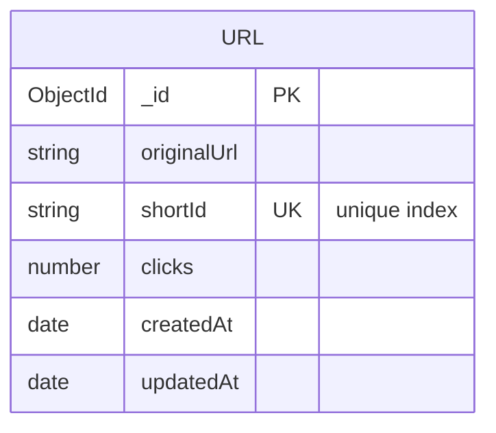

# 03 — Database Design

## Phase 1 scope: a single collection



```js
// models/Url.js
{
  originalUrl: String,   // required
  shortId:     String,   // required, unique, indexed
  clicks:      Number,   // default 0
  createdAt:   Date,     // from { timestamps: true }
  updatedAt:   Date,     // from { timestamps: true }
}
```

## Why each field exists

| Field | Why it exists | Why NOT something else |
|---|---|---|
| `originalUrl` | The actual destination — the entire point of the system | Stored as a plain string, not parsed into host/path/query — Phase 1 never needs to query *into* the URL, only store and return it whole |
| `shortId` | The public-facing identifier in the redirect path | Not the same as MongoDB's `_id`. `_id` is a 12-byte ObjectId — usable as a short ID technically, but its hex string is 24 characters (not "short"), and exposing your primary key in public URLs leaks internal document ordering. A separate, intentionally-short, intentionally-random field is the right call. |
| `clicks` | The minimum viable analytics — Phase 4 builds a full event log on top of this, but a running counter is needed from day one so Phase 1 is independently demoable | Could instead count documents in a separate `Click` collection from the start — see "Future extensibility" below for why that's deferred, not skipped |
| `createdAt` / `updatedAt` | Free via Mongoose's `timestamps: true`; needed for Phase 3 ("show my links, newest first") and Phase 4 (date-bucketed analytics) | — |

## Indexing

```js
shortId: { type: String, required: true, unique: true, index: true }
```

`unique: true` creates a unique index, which does two things at once:

1. **Enforces uniqueness at the database level** — even if two
   concurrent requests both generate the same `shortId` (astronomically
   unlikely with nanoid(7), but not impossible — see
   docs/05-url-shortening-deep-dive.md for the math), MongoDB rejects the
   second insert with error code `11000`. The service layer catches that
   specific code and retries with a new ID (see `services/urlService.js`)
   rather than trusting probability blindly.
2. **Makes every redirect lookup O(log n)** instead of a full collection
   scan. The redirect path (`GET /:shortId`) is the **hottest** path in
   the entire system — it's hit on every single click, while a URL is
   only *created* once. An unindexed `shortId` would mean every redirect
   scans the entire collection; at scale that's the difference between a
   redirect taking single-digit milliseconds and seconds.

This "the read path is hotter than the write path, so optimize the index
for reads" reasoning is exactly the kind of tradeoff worth narrating in a
system design interview.

## Why MongoDB over a relational database (honest tradeoffs)

**In favor of MongoDB here:**
- A `Url` document is self-contained — the core redirect read never needs
  a join. Even once `userId`, `analytics`, and `customAlias` are added in
  later phases, the redirect path itself still only ever touches one
  document.
- Schema flexibility matters because this project *is* the multi-phase
  evolution story — fields get added phase by phase without formal
  migrations. In Postgres that's `ALTER TABLE` + a migration tool; in
  Mongo it's just adding the field to the schema and it's optional/absent
  on old documents until backfilled.
- Horizontal scaling (sharding) is more natural in MongoDB if this ever
  needed to scale past a single node — relevant for the discussion in
  docs/10-system-design.md.

**Where a relational database would arguably be a *better* fit, and why
that's worth saying out loud in an interview rather than pretending Mongo
is strictly superior:**
- Once Phase 4 analytics needs aggregations like "clicks per day per
  user, joined against the URLs they own," that's a textbook relational
  query (`GROUP BY` + `JOIN`). MongoDB's aggregation pipeline *can* do
  this, but it's more verbose than SQL for genuinely relational
  questions.
- `User` owning many `Url`s, each owning many `Click` events, is a
  classic one-to-many-to-many relational shape. Modeling it in Mongo
  works (via references, not embedding — see below) but you're
  essentially hand-rolling some of what a relational DB gives you for
  free (referential integrity, joins).
- A reasonable, honest answer in an interview: *"I chose Mongo because
  the core entity is document-shaped and schema evolution was a known
  requirement going in; for the analytics-heavy phases I lean on
  Mongo's aggregation pipeline, and I can articulate where a relational
  store would have made those queries simpler."* That's a stronger
  answer than insisting one database is universally correct.

## Future extensibility — what gets added, and when

| Phase | New field(s) on `Url` | New collection |
|---|---|---|
| 2 | — | `User` (id, email, password hash) |
| 3 | `user: ObjectId (ref: User)` | — |
| 4 | — | `Click` (urlId, timestamp, referrer, browser, device) — see docs/06-analytics-system.md for why clicks become their own collection instead of staying an embedded array on `Url` |
| 5 | `customAlias: String (unique, sparse index)` | — |
| 6 | — | (QR codes generated on-demand, not stored) |

The `Click` collection (Phase 4) is deliberately **not** an embedded
array inside `Url` (e.g. `url.clickEvents: [...]`). MongoDB documents
have a 16MB size limit, and a popular link could accumulate millions of
click events — an unbounded embedded array is a scaling time bomb. A
separate collection referencing `urlId` is the correct shape, and
explaining *why you didn't embed* is a strong signal in a system design
interview (embedding vs. referencing is one of the most commonly asked
MongoDB schema design questions — covered in depth in
docs/06-analytics-system.md once Phase 4 is built).
