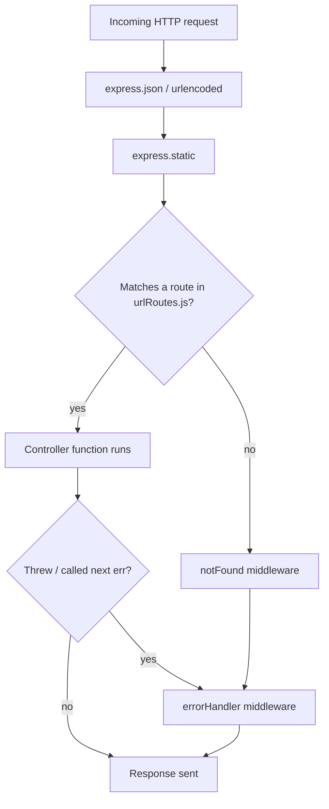
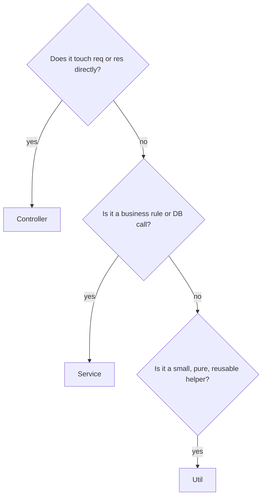
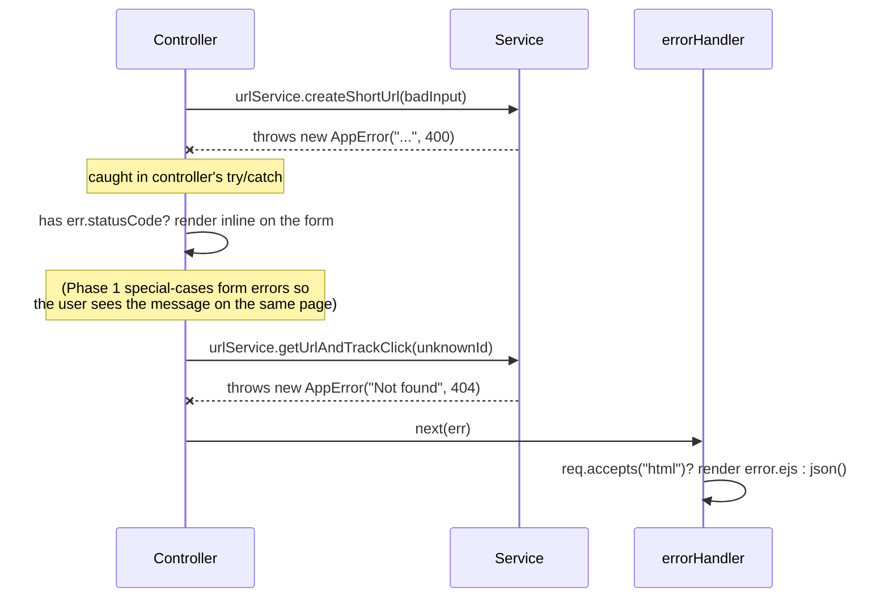

# 07 — Routing & Middleware (Phase 1 scope)

## Express request lifecycle, end to end



Every middleware and route is registered in `app.js`, **in order**, and
that order is not cosmetic — it's the actual execution order:

```js
app.use(express.json());
app.use(express.urlencoded({ extended: true }));
app.use(express.static(...));
app.use("/", urlRoutes);
app.use(notFound);      // only reached if nothing above matched
app.use(errorHandler);  // only reached via next(err)
```

## What each middleware does, and why it's positioned where it is

| Middleware | Purpose | Why this position |
|---|---|---|
| `express.json()` | Parses `Content-Type: application/json` bodies into `req.body` | Must run before any route that reads `req.body` |
| `express.urlencoded({ extended: true })` | Parses HTML `<form>` submissions (`Content-Type: application/x-www-form-urlencoded`) into `req.body` | Same reason — the homepage's shorten form is a plain HTML form, not a JS `fetch()` call |
| `express.static(...)` | Serves `public/css`, `public/js` directly without hitting a route handler | Placed before app routes so static assets short-circuit early and never run through route-matching logic unnecessarily |
| `urlRoutes` | The app's actual routes | After parsing middleware, since routes need `req.body` available |
| `notFound` | Converts "no route matched" into a structured `AppError(404)` | Must come **after** all real routes — it's the fallback |
| `errorHandler` | Converts any `AppError` (or unexpected error) into a response | Must be **last**, and Express requires exactly 4 parameters `(err, req, res, next)` for it to be recognized as an error handler at all |

## Controllers vs. Services vs. Utils — where does new logic go?

A simple decision rule used throughout this project:



Concretely, in this codebase:

- **`isValidUrl(value)`** (utils) — pure function, no DB, no HTTP,
  reusable anywhere. Doesn't belong in the service because it has zero
  dependency on the database.
- **`createShortUrl(originalUrl)`** (service) — calls `isValidUrl`,
  generates an ID, talks to MongoDB, retries on collision. This *is*
  the business rule for "what makes a valid short URL creation," so it
  lives in the service, not the controller.
- **`createShortUrl(req, res, next)`** (controller, same name —
  different layer) — reads `req.body.originalUrl`, calls the service,
  decides how to render the response (HTML form re-render vs. JSON, in
  later phases). Contains **zero** validation logic itself; it just
  reacts to what the service throws.

## How errors actually flow through this system



Two error-handling paths coexist on purpose: the **shorten form** renders
its own error inline (so the user doesn't lose their place and sees
"Please enter a valid URL" right next to the input), while the
**redirect** route forwards to the centralized `errorHandler` (a 404 on a
redirect has nowhere "inline" to render — it needs its own page). Both
ultimately rely on the same `AppError` class and the same `statusCode`
convention, so the *handling* logic stays consistent even when the
*presentation* differs.

## A note on `next()` and async errors

Every async controller function is wrapped in `try { ... } catch (err) {
next(err) }`. This is necessary because **Express does not automatically
catch rejected promises** in versions before Express 5 (this project
pins Express 4.x for stability/familiarity, since that's still the
overwhelming majority of real-world codebases and interview-relevant
knowledge). Forgetting this `try/catch` is one of the most common Express
bugs — an unhandled promise rejection in a route handler will hang the
request or crash the process depending on Node version, with no response
ever sent to the client. This is documented further with concrete repro
steps in docs/13-common-bugs-and-debugging.md (added later).
