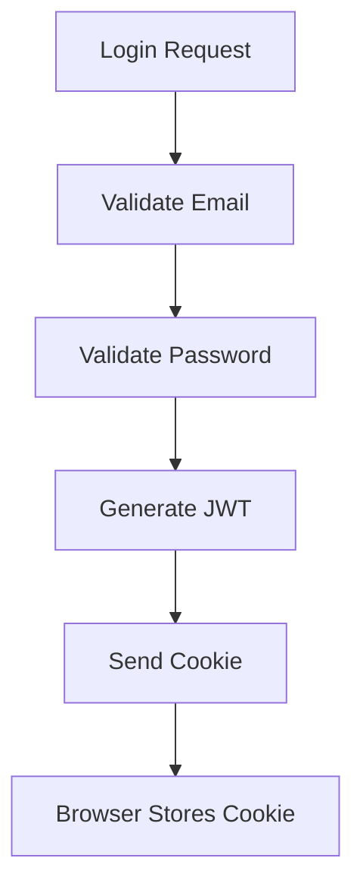
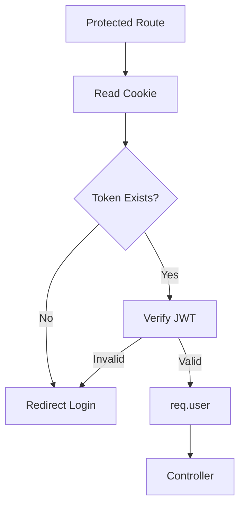

This is enough. I can see your entire Phase 2 architecture now.

One thing I would add to the documentation:

```text
Current Implementation Status

Authentication: Complete
Authorization: Partial (role exists but not yet used)
RBAC: Planned for future phases
Refresh Tokens: Not implemented
Secure Cookies: Production enhancement
```

That shows maturity in interviews.

---

# Authentication Deep Dive — Interview Notes

## 1. What Problem Are We Solving?

The URL shortener now has:

```text
Users
URLs
Analytics
Dashboard
```

We need to answer:

```text
Who is creating URLs?
Who owns a URL?
Who can access analytics?
```

Authentication solves identity.

Authorization solves permissions.

---

## 2. Authentication vs Authorization

### Authentication

Authentication answers:

```text
Who are you?
```

Example:

```text
Email
Password
```

System verifies credentials.

Result:

```text
User = Ishan
```

---

### Authorization

Authorization answers:

```text
What can you do?
```

Example:

```text
USER
ADMIN
```

Result:

```text
USER → create URL
ADMIN → manage users
```

In your project:

```js
role: {
  type: String,
  enum: ["USER", "ADMIN"],
  default: "USER",
}
```

Authorization infrastructure already exists.

---

## 3. Signup Flow

### Controller

```text
POST /signup
```

Controller:

```js
await signupUser(req.body);
```

---

### Service Layer

```js
const existingUser = await User.findOne({ email });
```

Purpose:

```text
Prevent duplicate accounts.
```

---

### User Creation

```js
const user = await User.create(...)
```

Triggers:

```js
pre("save")
```

middleware.

---

## 4. Why Password Hashing?

Never store:

```text
123456
```

inside MongoDB.

Store:

```text
$2b$10$...
```

instead.

---

### Current Implementation

```js
userSchema.pre("save", async function(next){
   ...
});
```

---

### Flow

```text
Password
↓
bcrypt.hash()
↓
MongoDB
```

---

## Interview Question

### Why hash passwords?

Answer:

> If the database is compromised, attackers should not immediately obtain user passwords. Hashing converts passwords into one-way representations.

---

## 5. Why bcrypt?

### Problem

Simple hashes:

```text
SHA256
MD5
```

are too fast.

Attackers can try billions of guesses.

---

### bcrypt

Purposefully slow.

```js
bcrypt.hash(password, 10)
```

Cost factor:

```text
10 rounds
```

---

### Interview Answer

> bcrypt is adaptive and computationally expensive, making brute-force attacks significantly harder than general-purpose hashing algorithms.

---

## 6. Login Flow

### Request

```text
POST /login
```

Body:

```json
{
  "email":"abc@gmail.com",
  "password":"secret"
}
```

---

### User Lookup

```js
const user = await User.findOne({ email });
```

---

### Password Verification

```js
const isMatch =
   await user.comparePassword(password);
```

---

### comparePassword()

```js
bcrypt.compare(
   password,
   this.password
);
```

bcrypt hashes the incoming password and compares safely.

---

## 7. JWT Introduction

JWT = JSON Web Token

Purpose:

```text
Maintain login state
without storing session data
on the server.
```

---

### Structure

```text
Header.Payload.Signature
```

Example:

```text
xxxxx.yyyyy.zzzzz
```

---

## 8. JWT Payload

Current implementation:

```js
jwt.sign({
    id:user._id,
    role:user.role
})
```

Payload:

```json
{
  "id":"123",
  "role":"USER"
}
```

---

## 9. JWT Generation Flow



---

## 10. Why JWT_SECRET?

Current:

```js
process.env.JWT_SECRET
```

Purpose:

```text
Digitally sign JWTs.
```

Without the secret:

```text
Anyone could forge tokens.
```

---

## Interview Question

### What happens if JWT_SECRET changes?

Answer:

> All previously issued tokens become invalid because signatures can no longer be verified.

---

## 11. Cookie Storage

Current:

```js
res.cookie("token", token, {
   httpOnly:true,
   sameSite:"strict"
});
```

---

### Why Cookie?

Alternative:

```text
localStorage
```

Your implementation uses cookies.

Good choice.

---

### httpOnly

```js
httpOnly:true
```

Prevents:

```text
document.cookie
```

access.

Protection against many XSS attacks.

---

### sameSite

```js
sameSite:"strict"
```

Helps reduce:

```text
CSRF attacks
```

---

## Interview Question

### Cookie vs Local Storage

Answer:

| Cookie             | Local Storage |
| ------------------ | ------------- |
| Sent automatically | Manual        |
| Supports httpOnly  | No            |
| Better for auth    | Less secure   |

---

## 12. Authentication Middleware

Current:

```js
authenticate()
```

Purpose:

```text
Protect routes.
```

---

### Flow



---

## 13. req.user

Current:

```js
req.user = decoded;
```

This is critical.

Every future feature:

```text
Dashboard
Analytics
Delete URL
Edit URL
```

will rely on:

```js
req.user.id
```

---

## 14. Logout Flow

Current:

```js
res.clearCookie("token");
```

Purpose:

```text
Remove browser token.
```

Flow:

```text
Cookie Deleted
↓
Next Protected Request
↓
authenticate()
↓
Redirect Login
```

---

## Interview Question

### How does logout work with JWT?

Answer:

> The JWT itself remains valid until expiry, but removing it from the browser prevents it from being sent to the server, effectively logging the user out.

---

## 15. redirectIfAuthenticated()

Purpose:

Prevent:

```text
Logged-in user
↓
/login
```

and

```text
Logged-in user
↓
/signup
```

---

### Flow

```text
Already Logged In
↓
Redirect Home
```

Improves UX.

---

## 16. Current Security Level

Implemented:

✅ bcrypt

✅ JWT

✅ Cookies

✅ httpOnly

✅ sameSite

✅ Password Hashing

✅ Protected Routes

---

Not Yet Implemented:

❌ Helmet

❌ Rate Limiting

❌ Input Validation

❌ Refresh Tokens

❌ Secure Cookies

These belong to later phases.

---

## Top Interview Questions

1. Authentication vs Authorization?
2. Why bcrypt instead of SHA256?
3. What is JWT?
4. JWT Structure?
5. Why JWT_SECRET?
6. Why cookies instead of localStorage?
7. What does httpOnly do?
8. What does sameSite do?
9. How does logout work in JWT systems?
10. What happens if JWT expires?
11. Why store user ID in JWT?
12. Why not store passwords in plain text?
13. How does middleware protect routes?
14. Why use environment variables?
15. What happens if JWT_SECRET leaks?

If you turn this into `docs/04-authentication-deep-dive.md`, it will already be strong enough to discuss confidently in most internship and campus placement interviews.
