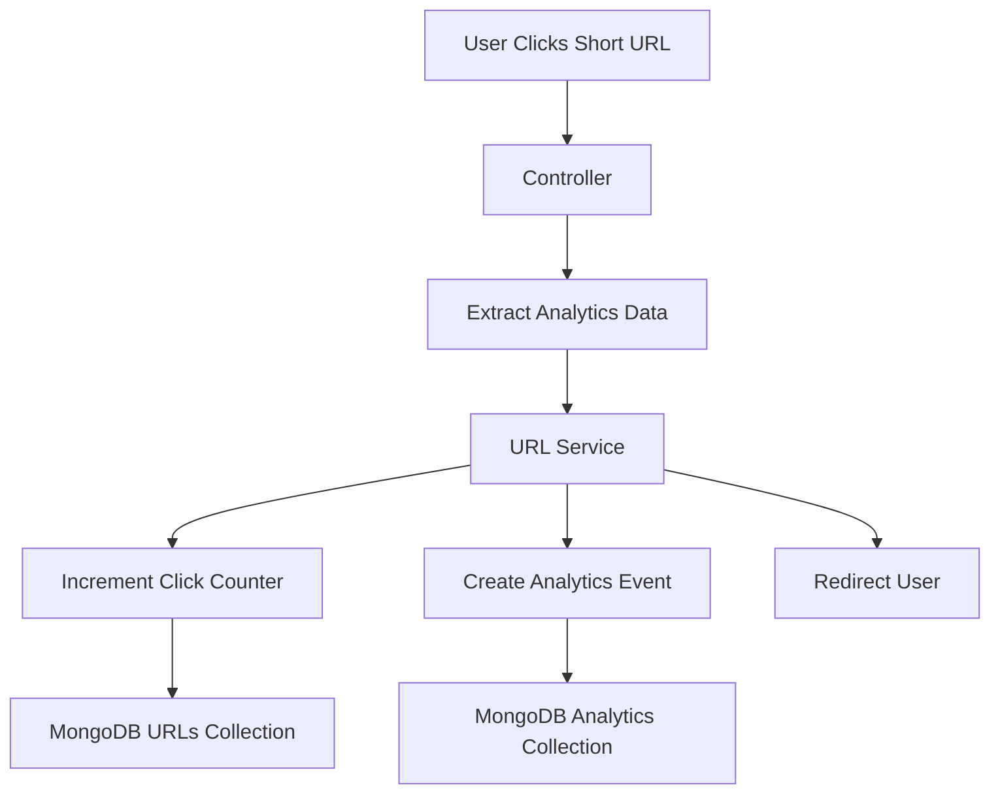

# Analytics System Deep Dive

## Overview

Phase 4 transforms the project from a simple URL shortener into a URL analytics platform.

Without analytics, a URL shortener only performs redirects.

With analytics, users can answer questions such as:

* How many times was my URL clicked?
* When was it clicked?
* Which browsers were used?
* Which devices were used?
* Where did visitors come from?

This is the primary value proposition of modern URL-shortening platforms such as Bitly.

---

# Why Analytics Exists

A shortened URL is useful.

Analytics make it valuable.

For example:

A marketing team sends:

https://myapp.com/abc123

Analytics can reveal:

* 5,000 clicks
* 60% mobile traffic
* 30% Chrome users
* 50% visitors from LinkedIn

These insights help organizations understand user behavior.

---

# Analytics Requirements

This project tracks:

## Total Clicks

Number of times a short URL was visited.

Example:

```text
abc123 → 150 clicks
```

---

## Daily Clicks

Clicks grouped by day.

Example:

```text
2026-06-19 → 40
2026-06-20 → 50
2026-06-21 → 60
```

---

## Weekly Clicks

Clicks grouped by week.

Example:

```text
Week 24 → 150
```

---

## Monthly Clicks

Clicks grouped by month.

Example:

```text
June 2026 → 150
```

---

## Browser Tracking

Tracks:

```text
Chrome
Edge
Firefox
Safari
```

---

## Device Tracking

Tracks:

```text
Desktop
Mobile
Tablet
```

---

## Referrer Tracking

Tracks traffic source.

Examples:

```text
Direct
Google
LinkedIn
Twitter
```

---

# Analytics Architecture

## High-Level Flow



---

# Database Design

## Why Not Store Analytics Inside URL Documents?

Bad approach:

```js
{
  shortId: "abc123",

  visitHistory: [
    {},
    {},
    {},
    ...
  ]
}
```

Problems:

* Document grows forever
* Large memory usage
* Slow reads
* MongoDB document size limits

---

## Better Approach

Separate analytics collection.

### URLs Collection

```js
{
  shortId: "abc123",
  originalUrl: "...",
  clicks: 150
}
```

---

### Analytics Collection

One document per click.

```js
{
  shortId: "abc123",

  browser: "Chrome",

  device: "Desktop",

  referrer: "Direct",

  clickedAt: ISODate(...)
}
```

---

# Why Keep the Click Counter?

Question:

Why not calculate total clicks from analytics documents?

Example:

```js
Analytics.countDocuments(...)
```

Answer:

Because dashboards need fast reads.

Current approach:

```js
Url.clicks
```

allows:

```js
Url.find(...)
```

to immediately return totals.

Benefits:

* Faster dashboard rendering
* Less aggregation work
* Better scalability

This is a common production optimization.

---

# Analytics Event Model

One click equals one analytics event.

Example:

User opens:

```text
https://myapp.com/abc123
```

System stores:

```js
{
  shortId: "abc123",

  browser: "Chrome",

  device: "Desktop",

  referrer: "Direct",

  clickedAt: "2026-06-21"
}
```

Every click creates a new event.

---

# Redirect Flow

## Step 1

User requests:

```http
GET /abc123
```

---

## Step 2

Controller extracts analytics metadata.

### Browser

From:

```http
User-Agent
```

Using:

```js
UAParser
```

Result:

```text
Chrome
Edge
Firefox
Safari
```

---

### Device

Result:

```text
Desktop
Mobile
Tablet
```

---

### Referrer

Obtained using:

```js
req.get("referer")
```

Possible values:

```text
google.com
linkedin.com
twitter.com
Direct
```

---

## Step 3

Service increments clicks.

```js
$inc: { clicks: 1 }
```

---

## Step 4

Service creates analytics document.

---

## Step 5

User is redirected.

```http
302 Redirect
```

---

# Why Use $inc?

Current implementation:

```js
findOneAndUpdate(
  { shortId },
  {
    $inc: {
      clicks: 1
    }
  }
)
```

---

## Interview Question

Why not:

```js
find()

clicks++

save()
```

Answer:

Race condition.

Example:

Two users click simultaneously.

Both read:

```text
clicks = 10
```

Both save:

```text
11
```

Expected:

```text
12
```

One click is lost.

---

## MongoDB Solution

```js
$inc
```

is atomic.

MongoDB guarantees correctness.

---

# Aggregation Pipelines

Analytics dashboards require reporting.

MongoDB Aggregation Pipelines provide reporting capabilities.

---

# Daily Clicks

Group by date.


Output:

```text
2026-06-19 → 10
2026-06-20 → 15
2026-06-21 → 20
```

---

# Weekly Clicks

Group by week number.

Output:

```text
Week 24 → 45
```

---

# Monthly Clicks

Group by month.

Output:

```text
2026-06 → 45
```

---

# Browser Analytics

Group by:

```js
browser
```

Output:

```text
Chrome → 100
Edge → 30
Firefox → 20
```

---

# Device Analytics

Group by:

```js
device
```

Output:

```text
Desktop → 80
Mobile → 60
```

---

# Referrer Analytics

Group by:

```js
referrer
```

Output:

```text
Direct → 50
Google → 20
LinkedIn → 15
```

---

# Authorization

Analytics are private.

Users should only view analytics for URLs they own.

Validation:

```js
shortId
+
createdBy
```

must match.

Example:

```js
getUrlByIdAndOwner()
```

prevents access to another user's analytics.

---

# Indexing Strategy

Analytics Collection:

```js
shortId
clickedAt
urlId
```

indexed.

Benefits:

* Faster lookups
* Faster aggregations
* Better scalability

---

# Scalability Discussion

## Current Scale

```text
100 Users
1,000 URLs
10,000 Clicks
```

No issues.

---

## Larger Scale

```text
100,000 URLs
10 Million Clicks
```

Analytics collection grows rapidly.

However:

* URL reads remain fast
* Click counter remains fast
* Analytics queries use indexes

System remains practical.

---

# Interview Questions

## Why separate analytics collection?

To prevent URL documents from growing indefinitely and to support efficient reporting.

---

## Why keep clicks in Url schema?

Fast dashboard reads.

---

## Why use aggregation pipelines?

To generate reports without loading all documents into application memory.

---

## Why use $inc?

Atomic updates prevent race conditions.

---

## Why store browser and device information?

To understand user behavior and traffic patterns.

---

## Why store referrer information?

To identify traffic sources and marketing effectiveness.

---

## How would you scale analytics further?

* Background jobs
* Data warehousing
* Event streaming
* Redis caching
* Aggregated reporting tables

Not required for this project but common in large-scale systems.

---

# Key Takeaways

Phase 4 introduces:

* Event Tracking
* Aggregation Pipelines
* Reporting Systems
* Analytics Dashboards
* Data Modeling
* Indexing
* Authorization
* Scalability Considerations

These concepts appear frequently in backend engineering and system design interviews.
